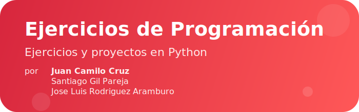

<p align="center">
	
</p>

# Herramientas de Programación

Este repositorio contiene ejercicios y proyectos desarrollados por estudiantes para la materia **Herramientas de Programación**.

## Integrantes
- Juan Camilo Cruz
- Santiago Gil Pareja
- Jose Luis Rodriguez Aramburo

## Archivos principales

- **BANCOPLATA.py**: Simulación de una cuenta bancaria con operaciones básicas (depósito, retiro, consulta de saldo).
- **CajeroAutomatico-tinker.py**: Cajero automático con interfaz gráfica usando Tkinter.
- **Diccionarios_bucles.py**: Ejercicios sobre diccionarios y bucles en Python.

## ¿Cómo ejecutar los ejercicios?
Asegúrate de tener **Python 3.x** instalado. Para ejecutar un ejercicio, usa el siguiente comando en la terminal:

```bash
python nombre_del_archivo.py
```
Por ejemplo:
```bash
python BANCOPLATA.py
```

---

<div align="center">
	<i>Trabajo académico realizado por estudiantes para la materia Herramientas de Programación - 2025</i>
</div>
